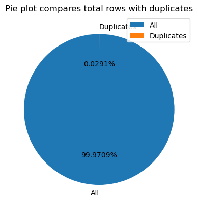
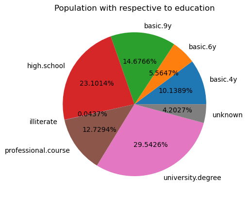
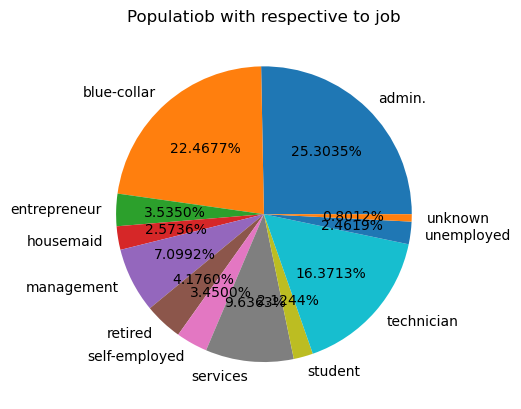
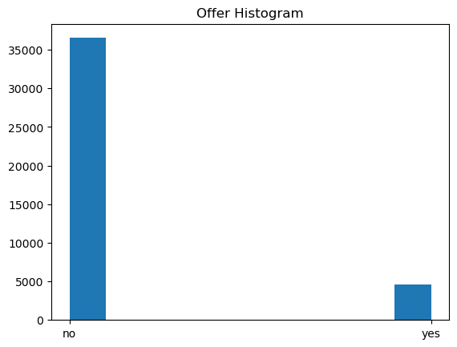
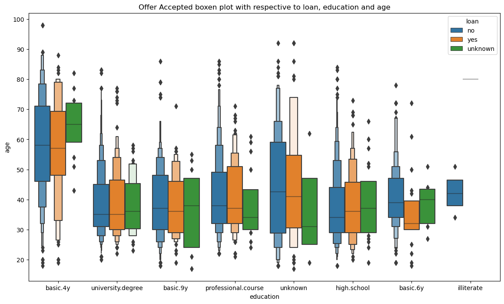
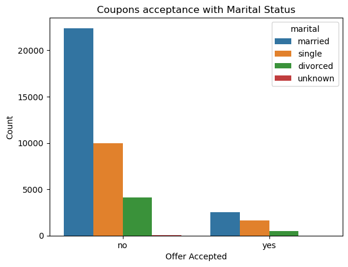

# bank_marketing_prediction
An ML model which predicts whether the customer accepts the product or not
## Introduction
The bankers need to know whether the campaigns they are running are effective or not and also predict how future campaigns are going to be.

## Dataset
The dataset with various features contains over 400K records which we will use to build a model.

## Data Understanding
This dataset has 400K records and 21 features. And this dataset doesnt have any nulls.

It has 12 duplicated records and removed those as they may not add value. Here is the plot of duplicates.

## Data Analysis
Here are some of the plots shows the data analysis of the dataset.
### Univariate Analysis
Here are some plots expain the feature analysis

This plot shows the how many customers accepted offers with  whats their educational qualifications. People with university  degree are accepting lot of  offers.

Plot shows the customers with their job status. A lot of are blue collar job holders.

 

This plot shows that many of customers are not accepting offers than who accepted. It clearly shows the tere is lot of imbalance in the data.

### Multivariate Analysis
Here are some plots shows the multivariate analysis of various features.

This plot shows the customers who accepted at what age and whats their education.
Customers at age 30-50 are accepting lot of offers with various educational levels.

This plot shows the married people are not accepting a lot of offers than single person.

