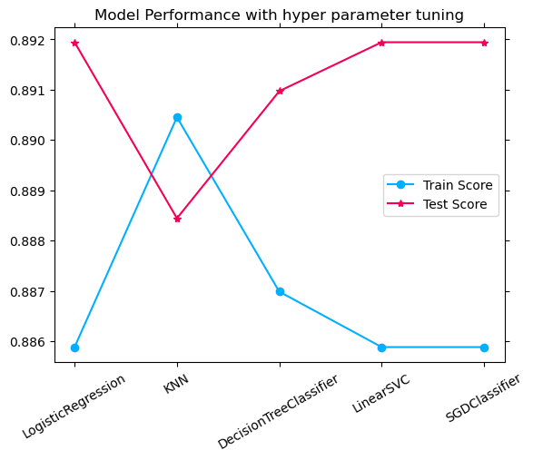

# Marketing Campaing Prediction of Bank Offers.
An ML model which predicts whether the customer accepts the product or not
## Introduction
The bankers need to know whether the campaigns they are running are effective or not and also predict how future campaigns are going to be.

## Notebook

Here is the [jupyter notebook](prompt_III.ipynb) that contains all the data anlysis, model building and intersting findings.

## Dataset
The dataset with various features contains over 400K records which we will use to build a model.

## Data Understanding
This dataset has 400K records and 21 features. And this dataset doesnt have any nulls.

It has 12 duplicated records and removed those as they may not add value. Here is the plot of duplicates.

## Data Analysis
Here are some of the plots shows the data analysis of the dataset.
### Univariate Analysis
Here are some plots expain the feature analysis

This plot shows the how many customers accepted offers with  whats their educational qualifications. People with university  degree are accepting lot of  offers.

Plot shows the customers with their job status. A lot of are blue collar job holders.

 

This plot shows that many of customers are not accepting offers than who accepted. It clearly shows the tere is lot of imbalance in the data.

### Multivariate Analysis
Here are some plots shows the multivariate analysis of various features.

This plot shows the customers who accepted at what age and whats their education.
Customers at age 30-50 are accepting lot of offers with various educational levels.

This plot shows the married people are not accepting a lot of offers than single person.

Here are some additional plots about multivariate analysis
 .

## Data Processing
There are many categorical features in this dataset like job,marital,education,default,housing,loan,contact and month etc...

Used **OrdinalEncoding** for ordinal features like month, day etc ... and **LabelEncoder** for others.

Here is the pair plot after encoding the dataset.

As per the ask, selected only the first 7 features to see the feature importance of these features.

This plot shows that **age** is the biggest contributor to the outcome of the results than other features.

## Model Building

After using the **StandardScaler** the below plot show the dataset balance between train and test splits of target class.

It shows that there is a imbalance in the train and test splits. We can use sklearn **resample** or **stratify** techniques to balance target  classes.

### Base Models

Trained the following models and compared the performance
* Logistic Regression
* KNN
* Decision Tree Classifier
* SVC
* LinearSVC
* SGDClassifier
* Guassian

The below plot shows the performance

It shows that DecisionTreeClassifier train score is higher than all models but its test score is very less. The better models are LinearRegression,SVC and LinearSVC.

Here is the train time of these models

In this the SVC is taking longer time to train the model than other models.

### Fine Tuned Models

Used **GridSearchCV** for tuning hyper parameters of the following models.
* LogisticRegression
* KNN
* DecisionTreeClassifier
* LinearSVC
* SGDClassifier

Here is the performance plot

It shows the LogisticRegression,LinearSVC and SGDClassfier are showing higher score than others.

### Accuracy Score

Here are the plots of confusion matrix of various models.

  

All these confusion matrix of various models predicts correctly the customers with offers not accepted but wrong predictions on who accepted the offers which means these models are overfit on training data only.

## Conclusion
