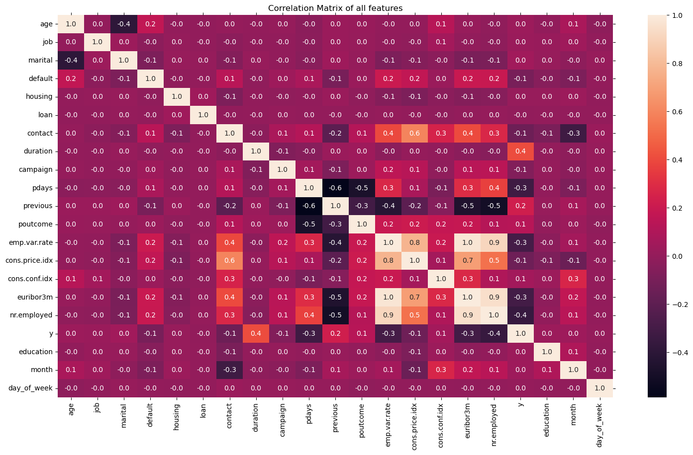

# Marketing Campaign Prediction of Bank Offers.
An ML model that predicts whether the customer accepts the product or not
## Introduction
The bankers need to know whether the campaigns they are running are effective or not and also predict how future campaigns are going to be.

## Notebook

Here is the [jupyter notebook](prompt_III.ipynb) that contains all the data analysis, model building and interesting findings.

## Project Organization

The project contains the following files and directories.
* **data** folder contains the dataset
* **images** folder plots of various data and model analysis
* a vscode workspace file
* CRISP DM of bank dataset pdf document
* Jupyter Notebook file
* README file

## Dataset
The dataset with various features contains over 400K records which we will use to build a model.

## Data Understanding
This dataset has 400K records and 21 features. And this dataset doesn't have any nulls.

It has 12 duplicated records and removed those as they may not add value. Here is the plot of duplicates.

## Data Analysis
Here are some of the plots that show the data analysis of the dataset.
### Univariate Analysis
Here are some plots that explain the feature analysis

This plot shows how many customers accepted offers based on their educational qualifications. People with university degrees are accepting a lot of offers.

The plot shows the customers with their job status. A lot of them are blue-collar job holders.

 

This plot shows that many customers are not accepting offers than those who accepted. It clearly shows that there is a lot of imbalance in the data.

### Multivariate Analysis
Here are some plots that show the multivariate analysis of various features.

This plot shows the customers who accepted at what age and what their education.
Customers aged 30-50 are accepting a lot of offers from various educational levels.

This plot shows that married people do not accept a lot of offers than single people.

Here are some additional plots about multivariate analysis.

 .

Here are a few plots showing the correlation between each feature in the dataset.

Its a mix of both positive and negative correlation of features in this dataset.

## Data Processing
There are many categorical features in this dataset like job, marital, education, default, housing, loan, contact, month etc...

Used **OrdinalEncoding** for ordinal features like month, day etc ... and **LabelEncoder** for others.

As per the ask, selected only the first 7 features to see the feature importance of these features.

This plot shows that **age** is the biggest contributor to the outcome of the results than other features.

## Model Building

After using the **StandardScaler** the below plot shows the dataset balance between train and test splits of target class.

It shows that there is an imbalance in the train and test splits. We can use sklearn **resample** or **stratify** techniques to balance target classes.

### Base Models

Trained the following models and compared the performance
* Logistic Regression
* KNN
* Decision Tree Classifier
* SVC
* LinearSVC
* SGDClassifier
* Guassian

The below plot shows the performance

It shows that DecisionTreeClassifier train score is higher than all models but its test score is much lower. The better models are LinearRegression, SVC and LinearSVC.

Here is the train time of these models

In this the SVC is taking longer time to train the model than other models.

### Fine Tuned Models

Used **GridSearchCV** for tuning hyperparameters of the following models.
* LogisticRegression
* KNN
* DecisionTreeClassifier
* LinearSVC
* SGDClassifier

Here is the performance plot
It shows that LogisticRegression, LinearSVC and SGDClassfier are showing higher scores than others.

### Model Accuracy

Here are the plots of the confusion matrix of various models.

  

All these confusion matrices of various models predict correctly the customers with offers not accepted but wrong predictions on who accepted the offers which means these models are overfitting on training data only.

### LogisticRegression with PCA

Evaluated LogisticRegression by considering all features and used PCA to reduce dimensionality.
With these techniques this model improved alot and performed at baseline 90% score.

Here is the confusion matrix of predictions on the training set.

This plot shows that the model predicted the true positives accurately close to  50% of target classes.

## Conclusion
Here are a few interesting observations during the training of these classification models.

* **Data Imbalance**:
The dataset is imbalanced in terms of target classes. So we improve the dataset to eliminate these imbalances it will improve model performance.
* **Model Prediction**: All classification models are accurately predicting in terms of offers not accepted but not when customers accepted offers. So due to data imbalance, the models predict wrong for these populations.
* **Additional Techniques**: Maybe using additional techniques like *ensemble* and/or dataset oversampling will help improve the model.
* **Additional Classification Models**: Using ensemble classification models like BaggingDecisionTree, RandomForest etc ... might improve the model performance with hyperparameter tuning.